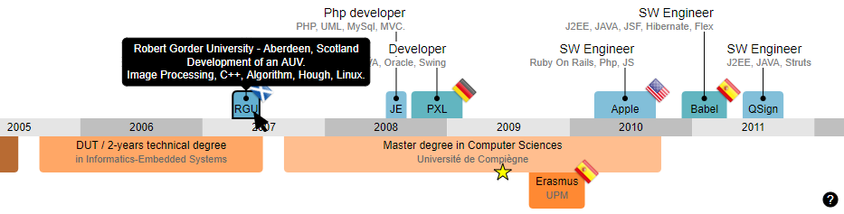

# Resume 2.0
Build easily an interactive resume with that JS library.

Only RaphaelJS & G.RaphaelJS libraries are required.

[Run example.html to try.](https://htmlpreview.github.io/?https://github.com/remmel/Resume-2.0/blob/master/example.html)

To add your personal information, update data.json
